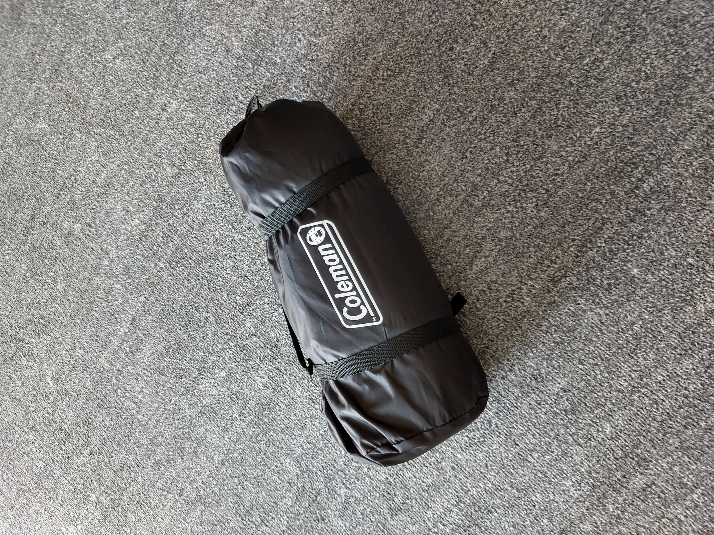

# TOURING DOME ST

## 内容

## インナーテント広げる

ランタンマークが前。メインポール（黒）を伸ばして上に置く。どっちが上でもいい。

## メインポール（黒）を入れる

まずはテントの後側のポケットに入れる。その後ポールを立てながら前のエンドピンに入れる。

## フックかける

てっぺんのフックは上のポールにつける。

## フロントポール（グレー）

テントサイド（ちょっと前側）のエンドピンにつける。テントの灰色フックにもつける。

## フライシート

縦に2つに別れているのが前で、真ん中で別れているのが後ろ

（前）

（後）

四隅のエンドピンのところのDリングにフライシートのフックをつける

フライシート内側のテープをポールに固定する（てっぺんのテープが見つからなかった、、、）。

